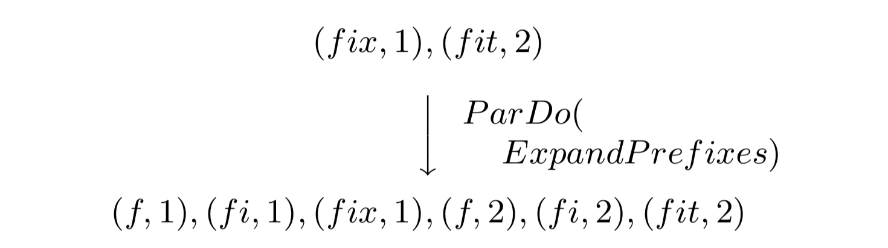
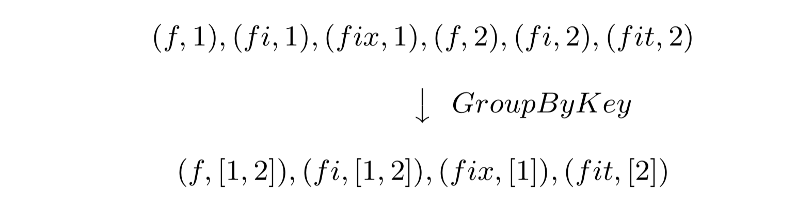

# The Dataflow Model: A Practical Approach to Balancing Correctness, Latency, and Cost in Massive-Scale, Unbounded, Out-of-Order Data Processing

原文链接: https://www.vldb.org/pvldb/vol8/p1792-Akidau.pdf

## INTRODUCTION

#### 现有系统的问题

+ 仅支持批处理：MapReduce(Pig/Hive)、FlumeJava
+ 无法保证大规模扩展时的容错能力：Aurora, TelegraphCQ, Niagara, Esper  
+ 无法提供绝对一次语义：Storm, Samza, Pulsar
+ 缺少基于时间的窗口操作：Tigon
+ 没有基于元组(Tuple)的窗口或基于处理时间的窗口：Spark Streaming, Sonora, Trident
+ 提供基于事件时间的窗口，但是依赖于数据有序：SQLStream
+ 提供基于事件时间的窗口，但是窗口触发器仅支持事件时间：Stratosphere/Flink
+ 缺少会话窗口：CEDR, Trill
+ 缺少对事件时间会话直接支持的编程模型：MillWheel、Spark Streaming

#### Lambda架构

+ 需要维护批/流两套系统
+ 需要在下游对批/流两组结果进行合并
+ Summingbird通过提供统一的批/流API来降低编程复杂性，但是对一些计算会有限制

#### 建立一个统一的模型

+ 对于无界无序数据源，支持基于事件时间计算有序结果，根据数据特征做窗口操作，并在正确性、延迟和运维成本之间达到平衡。
+ 将模型分解为四个维度：
    
    **What:** 对数据进行什么计算
    
    **Where:** 在**事件时间**的什么地方进行计算
    
    **When:** 在什么**处理时间**得到结果
    
    **How:** 如何根据较早数据调整当前结果

+ 将数据处理的概念与底层实现解耦，建立统一的模型描述批处理、微批处理和流式处理引擎

#### 具体实现的办法

+ **窗口模型**：可支持非对称的事件时间窗口
+ **触发器模型**：将结果输出时间和数据流的运行时特征绑定
+ **增量处理模型**：支持数据撤回或数据更新

###有界/无界 VS 流/批

当描述有限/无限数据集时，我们更偏向于使用有界/无界这个词，因为后者暗含了使用的执行引擎类型(流/批)。
在实际当中，无界数据可以通过循环执行一个批处理作业实现，而良好设计的流处理引擎也具备处理有界数据的能力。
   
###窗口

窗口操作将数据集切割成有限的数据块。当处理无界数据时，一部分运算是需要利用窗口操作来实现的，比如聚合、外链接。
有些运算用不到窗口，比如map、filter、内链接。对与批处理作业来说，窗口操作不是必要的。窗口操作总是基于时间的，
尽管很多系统支持元组窗口，但其本质上也是基于时间的。元组窗口操作实际是对带有连续递增逻辑时间戳的数据进行逻辑时域窗口。
窗口可能是对齐的也可能是非对齐的，对齐的窗口对窗口时间中所有数据都起作用，而非对齐窗口只是对一个数据子集起作用。
   

   
+ **固定窗口:** 通过一个固定的窗口大小来定义，比如一小时或者一天。固定窗口一般都是对齐的。

+ **滑动窗口:** 通过窗口大小和滑动周期定义，比如小时窗口，一分钟滑动一次。当滑动周期小于窗口大小时，意味着窗口是
有重叠区域的。滑动窗口通常也是对齐的。固定窗口可以看作是滑动窗口的一个特例，当窗口大小等于周期时，滑动窗口就相当于固定窗口。

+ **会话窗口:** 捕获部分数据的一些活跃时段，图中的例子是对每个key做窗口。通常会定义一个超时区间，所有小于超时时间的事件会被
分配到一组作为一个会话。会话窗口是非对齐的，对于Window2只对Key1其作用，Window3只对Key2起作用，Window1和4只对Key3起作用。

###时域

+ **事件时间:** 事件实际产生的时间

+ **处理时间:** 事件在数据流中处理时观测到的时间

对于某个事件，它的事件事件是永远不会改变的，但是随着事件在数据流中流动，它的处理时间是不断变化的。
由于网络通信、调度、数据处理以及序列化等原因，在实际系统中，处理时间通常是动态的延迟于事件时间的。
通过全局的进度指标，比如水位(watermarks)、标点(punctuations)，可以很直观的看到延迟区域。

水位的意思是，数据流中未完成数据事件时间的最小值(最旧的未处理数据)。

在实际系统中，因为不可预知的乱序问题，通常很难建立完全准确的水位，但是可以根据数据源的情况，建立启发式的水位。启发式的水位不能
完全保证在水位之后，不会有延迟的数据到来，但是利用数据源的一些特性，可以建立高度准确的启发式水位。

水位这个指标，可以让系统知道，某个事件时间之前的所有数据已经被观测到了。通过水位指标，我们可以直观的看到
实际水位和理想水位之间的延迟区域，这对于系统的健康和进度监控是很重要的。另外，对于某些不需要完全准确的场景，
系统也可以个根据水位进度做一些据测，比如进行垃圾回收。

在理想情况下，事件时间和处理时间之间的延迟是0，意味着系统在收到数据的瞬间就完成了处理。实际情况通常如上图所示，实际的水位
会延迟与理想水位。实际的延迟通常是动态变化的曲线。

## DATAFLOW MODEL

这一节将建立Dataflow模型，并且解释为什么这个模型可以覆盖批、微批、流以及Lambda架构的语义。

### 核心原语

从经典的批处理系统开始考虑，对于处理KV键值对，有两个关键的转换操作：

+ **ParDo** 用于数据的并发处理，每个输入的元素会被指定的UDF(在DataFlow中叫DoFn)处理，并输出0个或多个输出。
比如，一个将key扩展，并将Value复制给每一个扩展后的Key的操作：

+ **GroupByKey** 将数据按照Key来分组：

ParDo对输入数据的每个元素进行操作，因而很自然的能对无界数据使用。但是对于GroupByKey就没这么简单了，GroupByKey
将所以数据按照Key分组，然后发送给下游进行reduce，如果是无界数据，我们无法之后什么时候分组结束并下发数据。要解决这个
问题，就要用到窗口操作了。

### 窗口

支持GroupByKey的流式系统，通常把这个操作重新定义为GroupByKeyAndWindow。在这一小节，我们主要想讲如何支持非对齐窗口。
首先是因为，可以将所有类型的窗口策略都看作是非对齐，然后通过底层实现的来适配对齐窗口。第二是因为窗口操作可以拆分成分配窗口
和合并窗口两个步骤，对于任何窗口策略，都需要这两个步骤。

+ **分配窗口：** 将元素分配到0或多个窗口

+ **合并窗口：** 在分组时合并窗口。

为了支持基于事件时间的窗口，只传递(Key, Value)这样的键值对是不够的，需要传递(Key, Value, Event_time, Window)这样的
四元组。元素传递时需要带着它的事件时间戳，并且在一开始会被分配到一个默认的包含全部时间范围的全局窗口。这个全局
窗口提供的语义，实际上就是标准的批处理模型，即把所有数据都放在一个窗口统一处理。

#### 窗口分配

窗口分配时，每个元素会在它所属的窗口中复制一个新的元素。比如，当一个2min宽的每分钟滑动一次的滑动窗口，如下图：

在这个例子中，每个元素会重复出现在两个窗口中，因为窗口会出现重叠。因为元素是直接和他们所属的窗口相关的，所以窗口分配可能出现在
分组之前的任何位置。这一点很重要，因为很多分组操作，可能是被包含在某些符合运算里面的。比如Sum.integersPerKey，实际内部就包含了
分组操作。

#### 窗口合并

通过一个会话窗口执行GroupByKeyAndWindow的例子来讲解窗口合并。下文的图片展示了四个样例数据，三个k1和一个k2，这组数据会被分配到30分钟超时时间的会话窗口。
会话窗口的意思是，如果后续事件落入到超时时间的范围内，则会被认为是同一个会话。然后我们开始GroupByKeyAndWindow操作，这个操作分位5个步骤：

+ **DropTimestamps:** 取掉时间戳，因为后续的步骤和时间戳没关系了，只和元素所属的窗口有关。

+ **GroupByKey:** 根据key将(value, window)分组。

+ **MergeWindow:** 将同一个Key窗口缓存的数据合并。具体的合并逻辑是根据窗口策略定义的。在这个例子中，v1和v4的窗口是重叠的，所以会话窗口将他们合并到
一个新的窗口，一个更大的会话。

+ **GroupAlsoByWindow:** 再上一个步骤后，v1和v4属于了相同的窗口，这一步把它们分配到一起。

+ **ExpandToElements:** 将每个Key每个Window的值扩展成(key, value, event time, window)这样的四元组。在这个例子中，我们使用窗口的结束时间作为时间戳
但是任何大于或等于窗口中最早事件的时间戳的时间戳对于水印的正确性都是有效的。

### 触发器和增量计算

能够构建非对齐的事件事件窗口是一个进步，但是目前还有两个问题需要解决。

+ 我们也需要支持元组窗口和基于处理时间的窗口，否则我们只是重复了其他已有系统的窗口语义。

+ 我们需要知道何时把窗口结果发送下去。由于数据的事件时间是无序的，所以需要其他的信号告诉我们窗口什么时候完成了。

第一个元组窗口和处理时间窗口的问题，会在2.4节解决。谈到窗口完整性，一个初步的解决这个问题的想法，就是利用某个全局排序的事件时间进度指标，比如水位。
但是水位有两个缺点：

+ 水位有些时候**太快**了，这意味着有时候会有延迟的数据晚于水位到达。对于很多分布式数据源，很难得到一个完美的事件时间水位。也就是说，不可能仅仅依靠水位
做到百分百的数据准确性。

+ 水位有的时候又**太慢**了，因为它是一个全局的进度指标，水位可能因为一个延迟的点拖慢整个数据流进度。及时对于一个延迟曲线变化不太大的监控数据流，有些
数据源也可能导致几分钟的水位。结果就是，如果用水位作为唯一的触发窗口信号，可能会导致延迟比Lambda架构的数据流要大。

基于这些理由，我们假定只使用水位是不满足要求的。我们可以参考Lambda架构解决这个问题的思路：它并不能又快又准确的解决完整性问题，它只是快速的通过流式系统
提供一个估计的低延迟结果，然后当批处理完成时，才能够保证完整性和最终一致性。如果我们希望通过一条数据流解决这个问题(无论使用什么执行引擎)，
我们需要对任意窗口能够得到多份结果(panes，玻璃片)。我们把这个特性称为触发器，因为触发器可以允许我们指定何时获取一个窗口的输出。

换句话说，触发器是一种通过内部或外部信号刺激`GroupByKeyAndWindow`产出结果的机制。触发器是窗口模型的补充，它们在不同时间轴(事件时间/处理时间)上影响系统行为。

+ **Windowing** 决定数据在事件时间的什么地方进行分组处理。

+ **Triggering** 决定在处理时间的什么时候，将(一份)分组结果发射到下游。

我们的系统实现了一些预定义的触发器实现，比如在完成估计时触发(水位、分位水位)，在某个处理时间点触发，或者根据数据到达情况触发(比如计数、字节大小、数据标点、
模式匹配等)。我们也支持将触发器组合在一起，包括组成环、序列或其他的形式。甚至，用户也可以利用低层运行时的执行原语(水位定时器、处理时间定时器、数据到达等)
或者任何相关的信号(数据注入请求，外部进度指标、RPC回调)来实现自定义的触发器。

除了控制何时发射窗口结果之外，触发器还提供了对一个窗口的多份结果(panes)处理的方法，包括三种调整策略：

+ **丢弃：** 触发后，窗口的内的数据就会被丢弃，后续的结果和当前的结果没有关系。当下游消费者希望独立的受到各种触发下发的接过时，这种模式非常有用(比如当计算
系统注入值的和时)。对于数据缓存量来说，这种方式也是最有效率的，虽然对DataFlow模型的`Combiner`操作来说，增量通常很小。对于我们谈论的视频会话场景来说，
这个模式就不太适合了，因为我们不能要求下游去把结果合并到一起。

+ **累加:** 触发后，窗口内的数据会被完好的留在持久化的状态存储中，而后续的数据将会在之前的结果基础上调整。当下游消费者在收到多次同一个窗口的结果时，希望
新的结果覆盖旧的结果时，这种方式是比较适用的。当代替Lambda架构的系统时，这种方式也比较合适，因为Lambda架构就是用晚到的批处理结果覆盖先到的实时结果。对于
视频会话的场景，如果我们只希望计算会话后，将结果直接写到支持更新的存储时，可以使用这种方式。

+ **累加撤销:** 触发后，除了进行累加之外，还会多存一份发射的结果到持久化状态存储中，然后当这个窗口再次触发时，会先发一条数据撤回之前的值(比如负的last result)，
然后再发新的累加结果。当数据流中存在多个`GroupByKeyAndWindow`这样的操作时，为了避免一份数据在后续窗口重复累加，撤回操作是必须的。
Dataflow模型的`Combiner`是可逆的，可以通过执行`uncombine`来支持撤回。对于视频会话的场景，这个模型是非常合适的，比如我们想要在下游对会话执行聚合操作，
用于检测不活跃广告(观看时间小于5秒)。随着时间推移，初始的结果逐渐变得不那么有效了，比如早晨大量离线用户上线并开始发送会话数据。有了撤回，我们就可以更好的处理
包含有多个串行分组操作的复杂数据流。
